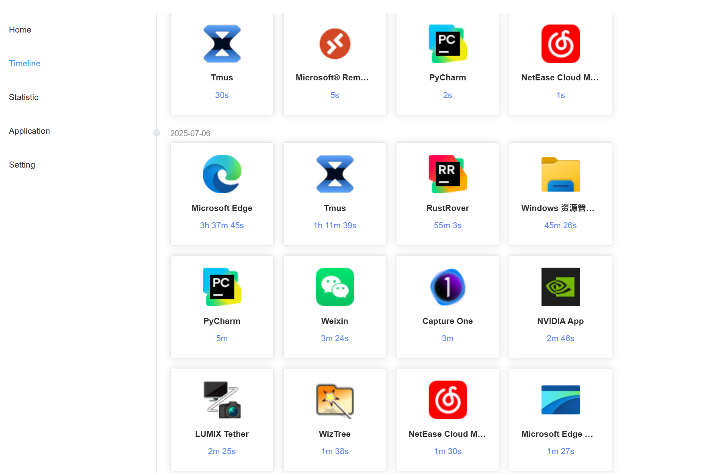
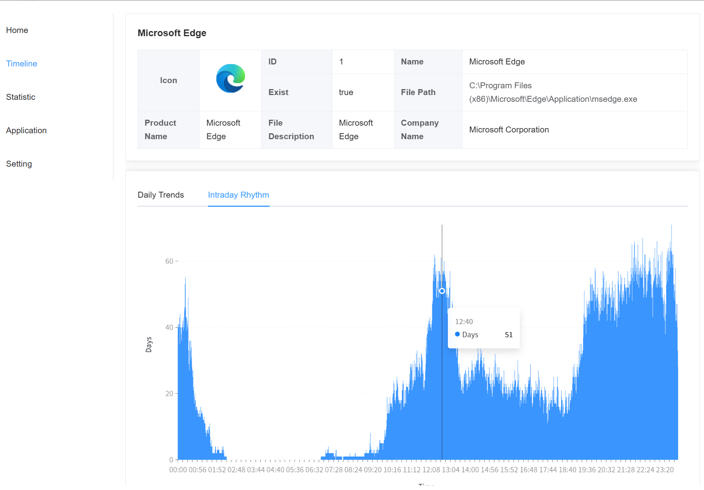

<p align="center">
  <a href="./README.zh-CN.md">简体中文</a> | English
</p>

# Tmus

<p align="center">
  
</p>

<p align="center">
  <strong>An open-source desktop application for tracking usage time.</strong><br>
  <sub>Effortlessly track the time you spend on various applications and cultivate healthy digital habits.</sub><br/>
  <sub>It's designed for high performance and minimal background resource consumption.</sub>
</p>

<p align="center">
  
  
  
  
  
</p>

---

## ✨ Features

- **Automatic Tracking**: Automatically records the time you spend on different applications in the background without manual intervention.
- **Data Visualization**: Intuitively displays your time allocation through various forms like heatmaps and weekly charts.
- **Application Insights**: View detailed statistics for each application, such as total usage time and active periods.
- **Timeline View**: Accurately review your application usage history in chronological order.
- **Lightweight & Efficient**: The core is written in Rust, ensuring low resource consumption, fast performance, and high security.
- **Open Source & Free**: Completely open source with no ads or paid features.

## 📸 Screenshots

<p align="center">
  <br/>
  <em>Timeline</em>
</p>
<p align="center">
  <br/>
  <em>Statistic</em>
</p>
<p align="center">
  <br/>
  <em>App Detail</em>
</p>

## 📦 Installation & Usage

### Prerequisites

Before you begin, ensure you have [Node.js](https://nodejs.org/en) (v18+), [pnpm](https://pnpm.io/), and the [Rust development environment](https://tauri.app/v1/guides/getting-started/prerequisites) installed.

### Local Development

1.  **Clone the repository**
    ```bash
    git clone https://github.com/saicem/tmus.git
    cd tmus
    ```

2.  **Install dependencies**
    ```bash
    pnpm install
    ```

3.  **Start the development server**
    ```bash
    pnpm tauri dev
    ```

### Building the Application

Run the following command to build the application for your platform:
```bash
pnpm tauri build
```
The build artifacts will be located in the `src-tauri/target/release/` directory.

## 🤝 Contributing

Contributions of all kinds are welcome! If you have any ideas or suggestions, feel free to open an [Issue](https://github.com/saicem/tmus/issues) or create a [Pull Request](https://github.com/saicem/tmus/pulls).

Please ensure you follow the existing code style before submitting your code.

## 📄 License

This project is licensed under the [MIT License](./LICENSE).