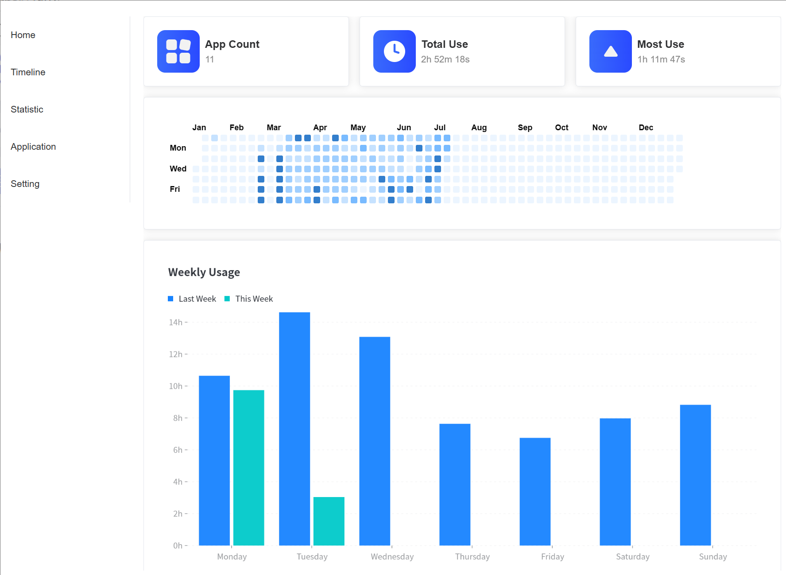
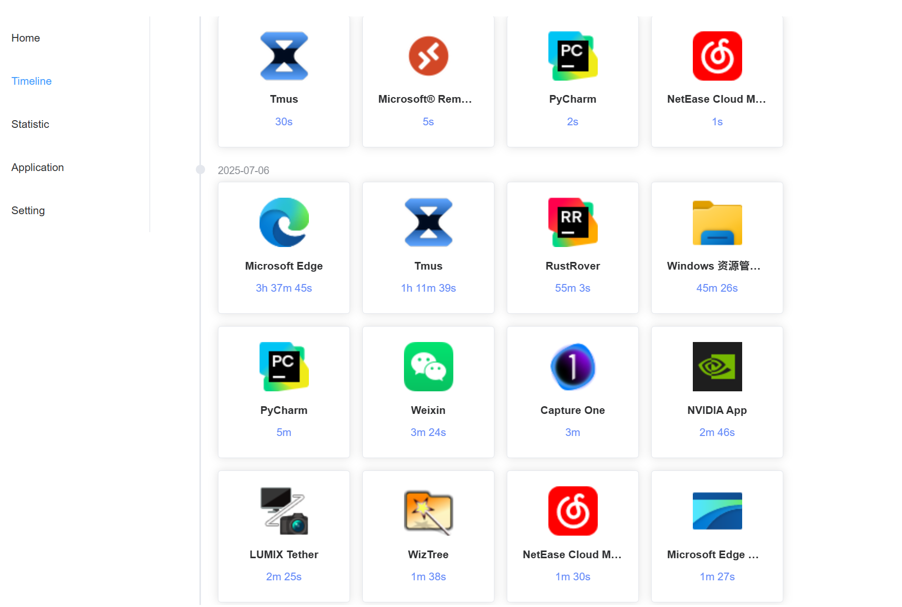
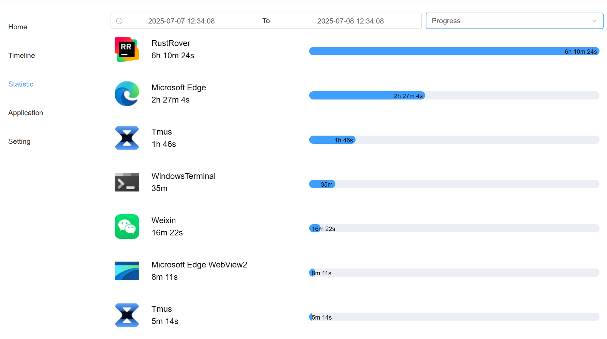
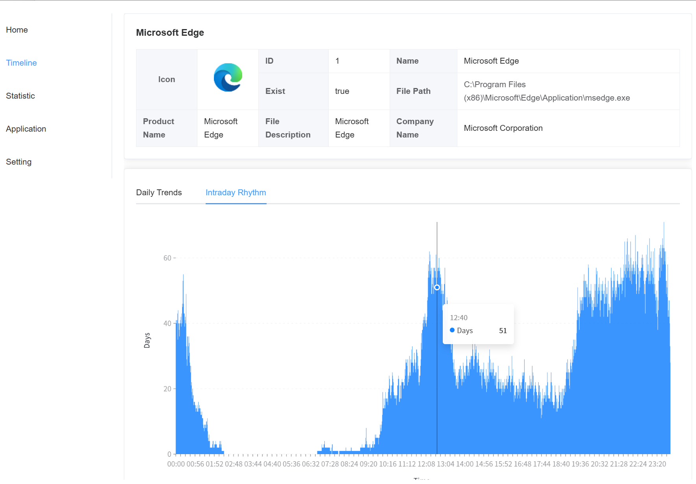

<p align="center">
  简体中文 | <a href="./README.md">English</a>
</p>

# Tmus

<p align="center">
  
</p>

<p align="center">
  <strong>一款开源的桌面端应用使用时长统计软件。</strong><br>
  <sub>轻松追踪您在各个应用上花费的时间，养成良好的数字习惯。</sub><br/>
  <sub>为高性能和低后台资源占用而设计。</sub>
</p>

<p align="center">
  
  
  
  
  
</p>

---

## ✨ 功能特性

- **自动追踪**: 在后台自动记录您在不同应用程序上花费的时间，无需手动干预。
- **数据可视化**: 通过热力图、面积图等多种形式直观展示您的时间分配。
- **应用洞察**: 查看每个应用的详细使用时长、活跃时段等统计数据。
- **时间线视图**: 按时间顺序精确回顾您的应用使用轨迹。
- **轻量高效**: 核心由 Rust 编写，占用资源少，运行速度快，安全可靠。
- **开源免费**: 完全开源，无任何广告或付费功能。

## 📸 截图

<p align="center">
  <br/>
  <em>时间线</em>
</p>
<p align="center">
  <br/>
  <em>统计</em>
</p>
<p align="center">
  <br/>
  <em>应用详情</em>
</p>

## 📦 安装与使用

### 环境准备

在开始之前，请确保您的开发环境中已安装 [Node.js](https://nodejs.org/en) (v18+), [pnpm](https://pnpm.io/)
和 [Rust 开发环境](https://tauri.app/v1/guides/getting-started/prerequisites)。

### 本地开发

1. **克隆仓库**
   ```bash
   git clone https://github.com/saicem/tmus.git
   cd tmus
   ```

2. **安装依赖**
   ```bash
   pnpm install
   ```

3. **启动开发环境**
   ```bash
   pnpm tauri dev
   ```

### 打包构建

执行以下命令来为您的平台打包应用程序：

```bash
pnpm tauri build
```

构建产物位于 `src-tauri/target/release/` 目录下。

## 🤝 贡献

欢迎各种形式的贡献！如果您有任何想法或建议，请随时提交 [Issue](https://github.com/saicem/tmus/issues)
或发起 [Pull Request](https://github.com/saicem/tmus/pulls)。

在提交代码前，请确保遵循项目已有的编码规范。

## 📄 许可证

本项目基于 [MIT](./LICENSE) 许可证。
